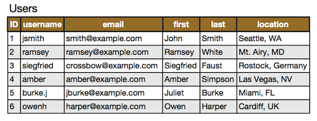
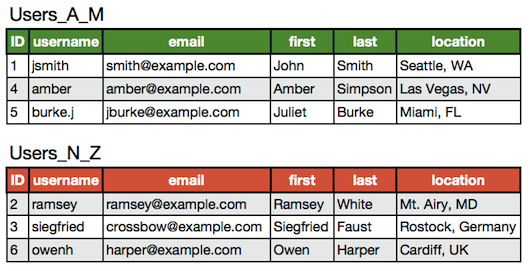

>文章：MySQL大表优化方案
>
>来源：segmentfault
>
>作者：manong
>
>链接：https://segmentfault.com/a/1190000006158186

------

<div style="margin-right: 10px;margin-left: 10px;display: flex;justify-content: center;align-items: center;">
  <div style="padding-top: 2px;padding-bottom: 2px;border-top: 1px solid rgb(31, 73, 125);border-bottom: 1px solid rgb(31, 73, 125);">
    <div style="padding: 2px 100px;border-top: 1px dashed rgb(31, 73, 125);border-bottom: 1px dashed rgb(31, 73, 125);">
      <p style="letter-spacing: 1.5px;">
        <span style="font-size: 18px;">
          总结整理
        </span>
        </span>
      </p>
    </div>
  </div>
</div>


<div style="margin-right: 10px;margin-left: 10px;display: flex;justify-content: center;align-items: center;">
  <div style="padding-top: 2px;padding-bottom: 2px;border-top: 1px solid rgb(31, 73, 125);border-bottom: 1px solid rgb(31, 73, 125);">
    <div style="padding: 2px 100px;border-top: 1px dashed rgb(31, 73, 125);border-bottom: 1px dashed rgb(31, 73, 125);">
      <p style="letter-spacing: 1.5px;">
        <span style="font-size: 18px;">
          正文开始
        </span>
        </span>
      </p>
    </div>
  </div>
</div>


当MySQL单表记录数过大时，增删改查性能都会急剧下降，可以参考以下步骤来优化：

### 单表优化

除非单表数据未来会一直不断上涨，否则不要一开始就考虑拆分，拆分会带来逻辑、部署、运维的各种复杂度，一般以整型值为主的表在`千万级`以下，字符串为主的表在`五百万`以下是没有太大问题的。而事实上很多时候MySQL单表的性能依然有不少优化空间，甚至能正常支撑千万级以上的数据量：

#### 字段

*   尽量使用`TINYINT`、`SMALLINT`、`MEDIUM_INT`作为整数类型而非`INT`，如果非负则加上`UNSIGNED`

*   `VARCHAR`的长度只分配真正需要的空间

*   使用枚举或整数代替字符串类型

*   尽量使用`TIMESTAMP`而非`DATETIME`，

*   单表不要有太多字段，建议在20以内

*   避免使用NULL字段，很难查询优化且占用额外索引空间

*   用整型来存IP

#### 索引

*   索引并不是越多越好，要根据查询有针对性的创建，考虑在`WHERE`和`ORDER BY`命令上涉及的列建立索引，可根据`EXPLAIN`来查看是否用了索引还是全表扫描

*   应尽量避免在`WHERE`子句中对字段进行`NULL`值判断，否则将导致引擎放弃使用索引而进行全表扫描

*   值分布很稀少的字段不适合建索引，例如"性别"这种只有两三个值的字段

*   字符字段只建前缀索引

*   字符字段最好不要做主键

*   不用外键，由程序保证约束

*   尽量不用`UNIQUE`，由程序保证约束

*   使用多列索引时主意顺序和查询条件保持一致，同时删除不必要的单列索引

#### 查询SQL

*   可通过开启慢查询日志来找出较慢的SQL

*   不做列运算：`SELECT id WHERE age + 1 = 10`，任何对列的操作都将导致表扫描，它包括数据库教程函数、计算表达式等等，查询时要尽可能将操作移至等号右边

*   sql语句尽可能简单：一条sql只能在一个cpu运算；大语句拆小语句，减少锁时间；一条大sql可以堵死整个库

*   不用`SELECT *`

*   `OR`改写成`IN`：`OR`的效率是n级别，`IN`的效率是log(n)级别，in的个数建议控制在200以内

*   不用函数和触发器，在应用程序实现

*   避免`%xxx`式查询

*   少用`JOIN`

*   使用同类型进行比较，比如用`'123'`和`'123'`比，`123`和`123`比

*   尽量避免在`WHERE`子句中使用!=或&lt;&gt;操作符，否则将引擎放弃使用索引而进行全表扫描

*   对于连续数值，使用`BETWEEN`不用`IN`：`SELECT id FROM t WHERE num BETWEEN 1 AND 5`

*   列表数据不要拿全表，要使用`LIMIT`来分页，每页数量也不要太大

#### 引擎

目前广泛使用的是MyISAM和InnoDB两种引擎：

##### MyISAM

MyISAM引擎是MySQL 5.1及之前版本的默认引擎，它的特点是：

*   不支持行锁，读取时对需要读到的所有表加锁，写入时则对表加排它锁

*   不支持事务

*   不支持外键

*   不支持崩溃后的安全恢复

*   在表有读取查询的同时，支持往表中插入新纪录

*   支持`BLOB`和`TEXT`的前500个字符索引，支持全文索引

*   支持延迟更新索引，极大提升写入性能

*   对于不会进行修改的表，支持压缩表，极大减少磁盘空间占用

##### InnoDB

InnoDB在MySQL 5.5后成为默认索引，它的特点是：

*   支持行锁，采用MVCC来支持高并发

*   支持事务

*   支持外键

*   支持崩溃后的安全恢复

*   不支持全文索引

总体来讲，MyISAM适合`SELECT`密集型的表，而InnoDB适合`INSERT`和`UPDATE`密集型的表

#### 系统调优参数

<div id="sys_param_opt"></div>可以使用下面几个工具来做基准测试：
*   **sysbench**：一个模块化，跨平台以及多线程的性能测试工具

*   **iibench-mysql**：基于 Java 的 MySQL/Percona/MariaDB 索引进行插入性能测试工具

*   **tpcc-mysql**：Percona开发的TPC-C测试工具

具体的调优参数内容较多，具体可参考官方文档，这里介绍一些比较重要的参数：

*   back_log：back_log值指出在MySQL暂时停止回答新请求之前的短时间内多少个请求可以被存在堆栈中。也就是说，如果MySql的连接数据达到max_connections时，新来的请求将会被存在堆栈中，以等待某一连接释放资源，该堆栈的数量即back_log，如果等待连接的数量超过back_log，将不被授予连接资源。可以从默认的50升至500

*   wait_timeout：数据库连接闲置时间，闲置连接会占用内存资源。可以从默认的8小时减到半小时

*   max_user_connection: 最大连接数，默认为0无上限，最好设一个合理上限

*   thread_concurrency：并发线程数，设为CPU核数的两倍

*   skip_name_resolve：禁止对外部连接进行DNS解析，消除DNS解析时间，但需要所有远程主机用IP访问

*   key_buffer_size：索引块的缓存大小，增加会提升索引处理速度，对MyISAM表性能影响最大。对于内存4G左右，可设为256M或384M，通过查询`show status like 'key_read%'`，保证`key_reads / key_read_requests`在0.1%以下最好

*   innodb_buffer_pool_size：缓存数据块和索引块，对InnoDB表性能影响最大。通过查询`show status like 'Innodb_buffer_pool_read%'`，保证` (Innodb_buffer_pool_read_requests – Innodb_buffer_pool_reads) / Innodb_buffer_pool_read_requests`越高越好

*   innodb_additional_mem_pool_size：InnoDB存储引擎用来存放数据字典信息以及一些内部数据结构的内存空间大小，当数据库对象非常多的时候，适当调整该参数的大小以确保所有数据都能存放在内存中提高访问效率，当过小的时候，MySQL会记录Warning信息到数据库的错误日志中，这时就需要该调整这个参数大小

*   innodb_log_buffer_size：InnoDB存储引擎的事务日志所使用的缓冲区，一般来说不建议超过32MB

*   query_cache_size：缓存MySQL中的ResultSet，也就是一条SQL语句执行的结果集，所以仅仅只能针对select语句。当某个表的数据有任何任何变化，都会导致所有引用了该表的select语句在Query Cache中的缓存数据失效。所以，当我们的数据变化非常频繁的情况下，使用Query Cache可能会得不偿失。根据命中率`(Qcache_hits/(Qcache_hits+Qcache_inserts)*100))`进行调整，一般不建议太大，256MB可能已经差不多了，大型的配置型静态数据可适当调大.
可以通过命令`show status like 'Qcache_%'`查看目前系统Query catch使用大小

*   read_buffer_size：MySql读入缓冲区大小。对表进行顺序扫描的请求将分配一个读入缓冲区，MySql会为它分配一段内存缓冲区。如果对表的顺序扫描请求非常频繁，可以通过增加该变量值以及内存缓冲区大小提高其性能

*   sort_buffer_size：MySql执行排序使用的缓冲大小。如果想要增加`ORDER BY`的速度，首先看是否可以让MySQL使用索引而不是额外的排序阶段。如果不能，可以尝试增加sort_buffer_size变量的大小

*   read_rnd_buffer_size：MySql的随机读缓冲区大小。当按任意顺序读取行时(例如，按照排序顺序)，将分配一个随机读缓存区。进行排序查询时，MySql会首先扫描一遍该缓冲，以避免磁盘搜索，提高查询速度，如果需要排序大量数据，可适当调高该值。但MySql会为每个客户连接发放该缓冲空间，所以应尽量适当设置该值，以避免内存开销过大。

*   record_buffer：每个进行一个顺序扫描的线程为其扫描的每张表分配这个大小的一个缓冲区。如果你做很多顺序扫描，可能想要增加该值

*   thread_cache_size：保存当前没有与连接关联但是准备为后面新的连接服务的线程，可以快速响应连接的线程请求而无需创建新的

*   table_cache：类似于thread_cache_size，但用来缓存表文件，对InnoDB效果不大，主要用于MyISAM

#### 升级硬件

Scale up，这个不多说了，根据MySQL是CPU密集型还是I/O密集型，通过提升CPU和内存、使用SSD，都能显著提升MySQL性能

### 读写分离

也是目前常用的优化，从库读主库写，一般不要采用双主或多主引入很多复杂性，尽量采用文中的其他方案来提高性能。同时目前很多拆分的解决方案同时也兼顾考虑了读写分离

### 缓存

缓存可以发生在这些层次：

*   MySQL内部：在[系统调优参数](#sys_param_opt)介绍了相关设置
*   数据访问层：比如MyBatis针对SQL语句做缓存，而Hibernate可以精确到单个记录，这里缓存的对象主要是持久化对象`Persistence Object`
*   应用服务层：这里可以通过编程手段对缓存做到更精准的控制和更多的实现策略，这里缓存的对象是数据传输对象`Data Transfer Object`
*   Web层：针对web页面做缓存
*   浏览器客户端：用户端的缓存

可以根据实际情况在一个层次或多个层次结合加入缓存。这里重点介绍下服务层的缓存实现，目前主要有两种方式：

*   直写式（Write Through）：在数据写入数据库后，同时更新缓存，维持数据库与缓存的一致性。这也是当前大多数应用缓存框架如Spring Cache的工作方式。这种实现非常简单，同步好，但效率一般。

*   回写式（Write Back）：当有数据要写入数据库时，只会更新缓存，然后异步批量的将缓存数据同步到数据库上。这种实现比较复杂，需要较多的应用逻辑，同时可能会产生数据库与缓存的不同步，但效率非常高。

### 表分区

MySQL在5.1版引入的分区是一种简单的水平拆分，用户需要在建表的时候加上分区参数，对应用是透明的无需修改代码

对用户来说，分区表是一个独立的逻辑表，但是底层由多个物理子表组成，实现分区的代码实际上是通过对一组底层表的对象封装，但对SQL层来说是一个完全封装底层的黑盒子。MySQL实现分区的方式也意味着索引也是按照分区的子表定义，没有全局索引


用户的SQL语句是需要针对分区表做优化，SQL条件中要带上分区条件的列，从而使查询定位到少量的分区上，否则就会扫描全部分区，可以通过`EXPLAIN PARTITIONS`来查看某条SQL语句会落在那些分区上，从而进行SQL优化，如下图5条记录落在两个分区上：
```
mysql> explain partitions select count(1) from user_partition where id in (1,2,3,4,5);
+----+-------------+----------------+------------+-------+---------------+---------+---------+------+------+--------------------------+
| id | select_type | table          | partitions | type  | possible_keys | key     | key_len | ref  | rows | Extra                    |
+----+-------------+----------------+------------+-------+---------------+---------+---------+------+------+--------------------------+
|  1 | SIMPLE      | user_partition | p1,p4      | range | PRIMARY       | PRIMARY | 8       | NULL |    5 | Using where; Using index |
+----+-------------+----------------+------------+-------+---------------+---------+---------+------+------+--------------------------+
1 row in set (0.00 sec)
```

分区的好处是：
*   可以让单表存储更多的数据
*   分区表的数据更容易维护，可以通过清楚整个分区批量删除大量数据，也可以增加新的分区来支持新插入的数据。另外，还可以对一个独立分区进行优化、检查、修复等操作
*   部分查询能够从查询条件确定只落在少数分区上，速度会很快
*   分区表的数据还可以分布在不同的物理设备上，从而搞笑利用多个硬件设备
*   可以使用分区表赖避免某些特殊瓶颈，例如InnoDB单个索引的互斥访问、ext3文件系统的inode锁竞争
*   可以备份和恢复单个分区

分区的限制和缺点：

*   一个表最多只能有1024个分区
*   如果分区字段中有主键或者唯一索引的列，那么所有主键列和唯一索引列都必须包含进来
*   分区表无法使用外键约束
*   NULL值会使分区过滤无效
*   所有分区必须使用相同的存储引擎

分区的类型：

*   RANGE分区：基于属于一个给定连续区间的列值，把多行分配给分区
*   LIST分区：类似于按RANGE分区，区别在于LIST分区是基于列值匹配一个离散值集合中的某个值来进行选择
*   HASH分区：基于用户定义的表达式的返回值来进行选择的分区，该表达式使用将要插入到表中的这些行的列值进行计算。这个函数可以包含MySQL中有效的、产生非负整数值的任何表达式
*   KEY分区：类似于按HASH分区，区别在于KEY分区只支持计算一列或多列，且MySQL服务器提供其自身的哈希函数。必须有一列或多列包含整数值

    分区适合的场景有：

*   最适合的场景数据的时间序列性比较强，则可以按时间来分区，如下所示：
```
CREATE TABLE members (
    firstname VARCHAR(25) NOT NULL,
    lastname VARCHAR(25) NOT NULL,
    username VARCHAR(16) NOT NULL,
    email VARCHAR(35),
    joined DATE NOT NULL
)
PARTITION BY RANGE( YEAR(joined) ) (
    PARTITION p0 VALUES LESS THAN (1960),
    PARTITION p1 VALUES LESS THAN (1970),
    PARTITION p2 VALUES LESS THAN (1980),
    PARTITION p3 VALUES LESS THAN (1990),
    PARTITION p4 VALUES LESS THAN MAXVALUE
);
```

查询时加上时间范围条件效率会非常高，同时对于不需要的历史数据能很容的批量删除。

*   如果数据有明显的热点，而且除了这部分数据，其他数据很少被访问到，那么可以将热点数据单独放在一个分区，让这个分区的数据能够有机会都缓存在内存中，查询时只访问一个很小的分区表，能够有效使用索引和缓存

另外MySQL有一种早期的简单的分区实现 - 合并表（merge table），限制较多且缺乏优化，不建议使用，应该用新的分区机制来替代

### 垂直拆分

垂直分库是根据数据库里面的数据表的相关性进行拆分，比如：一个数据库里面既存在用户数据，又存在订单数据，那么垂直拆分可以把用户数据放到用户库、把订单数据放到订单库。垂直分表是对数据表进行垂直拆分的一种方式，常见的是把一个多字段的大表按常用字段和非常用字段进行拆分，每个表里面的数据记录数一般情况下是相同的，只是字段不一样，使用主键关联

比如原始的用户表是：



垂直拆分后是：


垂直拆分的优点是：

*   可以使得行数据变小，一个数据块(Block)就能存放更多的数据，在查询时就会减少I/O次数(每次查询时读取的Block 就少)

*   可以达到最大化利用Cache的目的，具体在垂直拆分的时候可以将不常变的字段放一起，将经常改变的放一起

*   数据维护简单

缺点是：

*   主键出现冗余，需要管理冗余列

*   会引起表连接JOIN操作（增加CPU开销）可以通过在业务服务器上进行join来减少数据库压力

*   依然存在单表数据量过大的问题（需要水平拆分）

*   事务处理复杂

### 水平拆分

#### 概述

水平拆分是通过某种策略将数据分片来存储，分库内分表和分库两部分，每片数据会分散到不同的MySQL表或库，达到分布式的效果，能够支持非常大的数据量。前面的表分区本质上也是一种特殊的库内分表

库内分表，仅仅是单纯的解决了单一表数据过大的问题，由于没有把表的数据分布到不同的机器上，因此对于减轻MySQL服务器的压力来说，并没有太大的作用，大家还是竞争同一个物理机上的IO、CPU、网络，这个就要通过分库来解决

前面垂直拆分的用户表如果进行水平拆分，结果是：



实际情况中往往会是垂直拆分和水平拆分的结合，即将`Users_A_M`和`Users_N_Z`再拆成`Users`和`UserExtras`，这样一共四张表

水平拆分的优点是:

*   不存在单库大数据和高并发的性能瓶颈

*   应用端改造较少

*   提高了系统的稳定性和负载能力

缺点是：

*   分片事务一致性难以解决

*   跨节点Join性能差，逻辑复杂

*   数据多次扩展难度跟维护量极大

#### 分片原则

*   能不分就不分，参考<a>单表优化</a>

*   分片数量尽量少，分片尽量均匀分布在多个数据结点上，因为一个查询SQL跨分片越多，则总体性能越差，虽然要好于所有数据在一个分片的结果，只在必要的时候进行扩容，增加分片数量

*   分片规则需要慎重选择做好提前规划，分片规则的选择，需要考虑数据的增长模式，数据的访问模式，分片关联性问题，以及分片扩容问题，最近的分片策略为范围分片，枚举分片，一致性Hash分片，这几种分片都有利于扩容

*   尽量不要在一个事务中的SQL跨越多个分片，分布式事务一直是个不好处理的问题

*   查询条件尽量优化，尽量避免Select * 的方式，大量数据结果集下，会消耗大量带宽和CPU资源，查询尽量避免返回大量结果集，并且尽量为频繁使用的查询语句建立索引。

*   通过数据冗余和表分区赖降低跨库Join的可能

这里特别强调一下分片规则的选择问题，如果某个表的数据有明显的时间特征，比如订单、交易记录等，则他们通常比较合适用时间范围分片，因为具有时效性的数据，我们往往关注其近期的数据，查询条件中往往带有时间字段进行过滤，比较好的方案是，当前活跃的数据，采用跨度比较短的时间段进行分片，而历史性的数据，则采用比较长的跨度存储。

总体上来说，分片的选择是取决于最频繁的查询SQL的条件，因为不带任何Where语句的查询SQL，会遍历所有的分片，性能相对最差，因此这种SQL越多，对系统的影响越大，所以我们要尽量避免这种SQL的产生。

#### 解决方案

由于水平拆分牵涉的逻辑比较复杂，当前也有了不少比较成熟的解决方案。这些方案分为两大类：客户端架构和代理架构。

##### 客户端架构

通过修改数据访问层，如JDBC、Data Source、MyBatis，通过配置来管理多个数据源，直连数据库，并在模块内完成数据的分片整合，一般以Jar包的方式呈现

这是一个客户端架构的例子：


可以看到分片的实现是和应用服务器在一起的，通过修改Spring JDBC层来实现

客户端架构的优点是：

*   应用直连数据库，降低外围系统依赖所带来的宕机风险

*   集成成本低，无需额外运维的组件

缺点是：

*   限于只能在数据库访问层上做文章，扩展性一般，对于比较复杂的系统可能会力不从心

*   将分片逻辑的压力放在应用服务器上，造成额外风险

##### 代理架构

通过独立的中间件来统一管理所有数据源和数据分片整合，后端数据库集群对前端应用程序透明，需要独立部署和运维代理组件

这是一个代理架构的例子：


代理组件为了分流和防止单点，一般以集群形式存在，同时可能需要Zookeeper之类的服务组件来管理

代理架构的优点是：

*   能够处理非常复杂的需求，不受数据库访问层原来实现的限制，扩展性强

*   对于应用服务器透明且没有增加任何额外负载

缺点是：

*   需部署和运维独立的代理中间件，成本高

*   应用需经过代理来连接数据库，网络上多了一跳，性能有损失且有额外风险

##### 各方案比较

<table>
<thead><tr>
<th> </th>
<th>出品方</th>
<th>架构模型</th>
<th>支持数据库</th>
<th>分库</th>
<th>分表</th>
<th>读写分离</th>
<th>外部依赖</th>
<th>是否开源</th>
<th>实现语言</th>
<th>支持语言</th>
<th>最后更新</th>
<th>Github星数</th>
</tr></thead>
<tbody>
<tr>
<td>MySQL Fabric</td>
<td>MySQL官方</td>
<td>代理架构</td>
<td>MySQL</td>
<td>有</td>
<td>有</td>
<td>有</td>
<td>无</td>
<td>是</td>
<td>python</td>
<td>无限制</td>
<td>4个月前</td>
<td>35</td>
</tr>
<tr>
<td>Cobar</td>
<td>阿里巴巴</td>
<td>代理架构</td>
<td>MySQL</td>
<td>有</td>
<td>无</td>
<td>无</td>
<td>无</td>
<td>是</td>
<td>Java</td>
<td>无限制</td>
<td>两年前</td>
<td>1287</td>
</tr>
<tr>
<td>Cobar Client</td>
<td>阿里巴巴</td>
<td>客户端架构</td>
<td>MySQL</td>
<td>有</td>
<td>无</td>
<td>无</td>
<td>无</td>
<td>是</td>
<td>Java</td>
<td>Java</td>
<td>三年前</td>
<td>344</td>
</tr>
<tr>
<td>TDDL</td>
<td>淘宝</td>
<td>客户端架构</td>
<td>无限制</td>
<td>有</td>
<td>有</td>
<td>有</td>
<td>Diamond</td>
<td>只开源部分</td>
<td>Java</td>
<td>Java</td>
<td>未知</td>
<td>519</td>
</tr>
<tr>
<td>Atlas</td>
<td>奇虎360</td>
<td>代理架构</td>
<td>MySQL</td>
<td>有</td>
<td>有</td>
<td>有</td>
<td>无</td>
<td>是</td>
<td>C</td>
<td>无限制</td>
<td>10个月前</td>
<td>1941</td>
</tr>
<tr>
<td>Heisenberg</td>
<td>百度熊照</td>
<td>代理架构</td>
<td>MySQL</td>
<td>有</td>
<td>有</td>
<td>有</td>
<td>无</td>
<td>是</td>
<td>Java</td>
<td>无限制</td>
<td>2个月前</td>
<td>197</td>
</tr>
<tr>
<td>TribeDB</td>
<td>个人</td>
<td>代理架构</td>
<td>MySQL</td>
<td>有</td>
<td>有</td>
<td>有</td>
<td>无</td>
<td>是</td>
<td>NodeJS</td>
<td>无限制</td>
<td>3个月前</td>
<td>126</td>
</tr>
<tr>
<td>ShardingJDBC</td>
<td>当当</td>
<td>客户端架构</td>
<td>MySQL</td>
<td>有</td>
<td>有</td>
<td>有</td>
<td>无</td>
<td>是</td>
<td>Java</td>
<td>Java</td>
<td>当天</td>
<td>1144</td>
</tr>
<tr>
<td>Shark</td>
<td>个人</td>
<td>客户端架构</td>
<td>MySQL</td>
<td>有</td>
<td>有</td>
<td>无</td>
<td>无</td>
<td>是</td>
<td>Java</td>
<td>Java</td>
<td>两天前</td>
<td>84</td>
</tr>
<tr>
<td>KingShard</td>
<td>个人</td>
<td>代理架构</td>
<td>MySQL</td>
<td>有</td>
<td>有</td>
<td>有</td>
<td>无</td>
<td>是</td>
<td>Golang</td>
<td>无限制</td>
<td>两天前</td>
<td>1836</td>
</tr>
<tr>
<td>OneProxy</td>
<td>平民软件</td>
<td>代理架构</td>
<td>MySQL</td>
<td>有</td>
<td>有</td>
<td>有</td>
<td>无</td>
<td>否</td>
<td>未知</td>
<td>无限制</td>
<td>未知</td>
<td>未知</td>
</tr>
<tr>
<td>MyCat</td>
<td>社区</td>
<td>代理架构</td>
<td>MySQL</td>
<td>有</td>
<td>有</td>
<td>有</td>
<td>无</td>
<td>是</td>
<td>Java</td>
<td>无限制</td>
<td>两天前</td>
<td>1270</td>
</tr>
<tr>
<td>Vitess</td>
<td>Youtube</td>
<td>代理架构</td>
<td>MySQL</td>
<td>有</td>
<td>有</td>
<td>有</td>
<td>无</td>
<td>是</td>
<td>Golang</td>
<td>无限制</td>
<td>当天</td>
<td>3636</td>
</tr>
<tr>
<td>Mixer</td>
<td>个人</td>
<td>代理架构</td>
<td>MySQL</td>
<td>有</td>
<td>有</td>
<td>无</td>
<td>无</td>
<td>是</td>
<td>Golang</td>
<td>无限制</td>
<td>9个月前</td>
<td>472</td>
</tr>
<tr>
<td>JetPants</td>
<td>Tumblr</td>
<td>客户端架构</td>
<td>MySQL</td>
<td>有</td>
<td>有</td>
<td>无</td>
<td>无</td>
<td>是</td>
<td>Ruby</td>
<td>Ruby</td>
<td>10个月前</td>
<td>957</td>
</tr>
<tr>
<td>HibernateShard</td>
<td>Hibernate</td>
<td>客户端架构</td>
<td>无限制</td>
<td>有</td>
<td>有</td>
<td>无</td>
<td>无</td>
<td>是</td>
<td>Java</td>
<td>Java</td>
<td>4年前</td>
<td>57</td>
</tr>
<tr>
<td>MybatisShard</td>
<td>MakerSoft</td>
<td>客户端架构</td>
<td>无限制</td>
<td>有</td>
<td>有</td>
<td>无</td>
<td>无</td>
<td>是</td>
<td>Java</td>
<td>Java</td>
<td>11个月前</td>
<td>119</td>
</tr>
<tr>
<td>Gizzard</td>
<td>Twitter</td>
<td>代理架构</td>
<td>无限制</td>
<td>有</td>
<td>有</td>
<td>无</td>
<td>无</td>
<td>是</td>
<td>Java</td>
<td>无限制</td>
<td>3年前</td>
<td>2087</td>
</tr>
</tbody>
</table>

如此多的方案，如何进行选择？可以按以下思路来考虑：

1.  确定是使用代理架构还是客户端架构。中小型规模或是比较简单的场景倾向于选择客户端架构，复杂场景或大规模系统倾向选择代理架构

2.  具体功能是否满足，比如需要跨节点`ORDER BY`，那么支持该功能的优先考虑

3.  不考虑一年内没有更新的产品，说明开发停滞，甚至无人维护和技术支持

4.  最好按大公司-&gt;社区-&gt;小公司-&gt;个人这样的出品方顺序来选择

5.  选择口碑较好的，比如github星数、使用者数量质量和使用者反馈

6.  开源的优先，往往项目有特殊需求可能需要改动源代码

按照上述思路，推荐以下选择：

*   客户端架构：ShardingJDBC

*   代理架构：MyCat或者Atlas

### 兼容MySQL且可水平扩展的数据库

目前也有一些开源数据库兼容MySQL协议，如：

*   TiDB

*   Cubrid

但其工业品质和MySQL尚有差距，且需要较大的运维投入，如果想将原始的MySQL迁移到可水平扩展的新数据库中，可以考虑一些云数据库：

*   阿里云PetaData

*   阿里云OceanBase

*   腾讯云DCDB

### NoSQL

在MySQL上做Sharding是一种戴着镣铐的跳舞，事实上很多大表本身对MySQL这种RDBMS的需求并不大，并不要求ACID，可以考虑将这些表迁移到NoSQL，彻底解决水平扩展问题，例如：
*   日志类、监控类、统计类数据
*   非结构化或弱结构化数据
*   对事务要求不强，且无太多关联操作的数据

