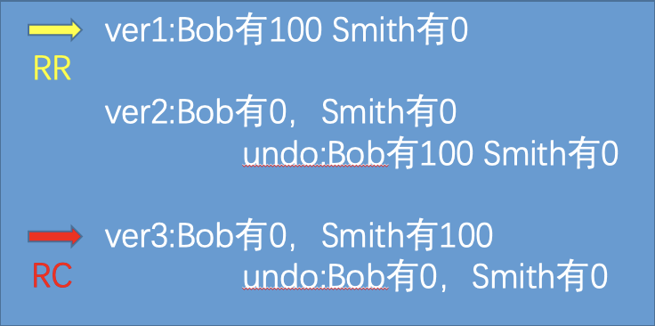

>文章：搞懂MySQL InnoDB事务ACID实现原理
>
>来源：博客园
>
>作者：GrimMjx
>
>链接：https://www.cnblogs.com/GrimMjx/p/10575147.html

------
<div style="margin-right: 10px;margin-left: 10px;display: flex;justify-content: center;align-items: center;">
  <div style="padding-top: 2px;padding-bottom: 2px;border-top: 1px solid rgb(31, 73, 125);border-bottom: 1px solid rgb(31, 73, 125);">
    <div style="padding: 2px 100px;border-top: 1px dashed rgb(31, 73, 125);border-bottom: 1px dashed rgb(31, 73, 125);">
      <p style="letter-spacing: 1.5px;">
        <span style="font-size: 18px;">
          正文开始
        </span>
        </span>
      </p>
    </div>
  </div>
</div>


## 前言
说到数据库事务，想到的就是要么都做修改，要么都不做，或者是 ACID 的概念。其实事务的本质就是锁、并发和重做日志的结合体。这一篇主要讲一下 InnoDB 中的事务到底是如何实现 ACID 的：

*   **原子性（atomicity）**
*   **一致性（consistency）**
*   **隔离性（isolation）**
*   **持久性（durability）**

##  隔离性

其实隔离性的实现原理就是**锁**，因而隔离性也可以称为并发控制、锁等。事务的隔离性要求每个读写事务的对象对其他事务的操作对象能互相分离。

再者，比如操作缓冲池中的 LRU 列表，删除，添加、移动 LRU 列表中的元素，为了保证一致性那么就要锁的介入。

InnoDB 使用锁是为了支持对共享资源进行并发访问，提供数据的完整性和一致性。那么到底 InnoDB 支持什么样的锁呢？我们先来看下 InnoDB 的锁的介绍：

###  InnoDB 中的锁

你可能听过各种各样的 InnoDB 的数据库锁，Gap 锁，共享锁，排它锁，读锁，写锁等等。但是 InnoDB 的标准实现的锁只有 2 类，一种是行级锁，一种是意向锁。

InnoDB 实现了如下两种标准的行级锁：
*   **共享锁（读锁 S Lock）**，允许事务读一行数据。
*   **排它锁（写锁 X Lock）**，允许事务删除一行数据或者更新一行数据。
行级锁中，除了 S 和 S 兼容，其他都不兼容。


InnoDB 支持两种意向锁（即为表级别的锁）：
*   **意向共享锁（读锁 IS Lock）**，事务想要获取一张表的几行数据的共享锁，事务在给一个数据行加共享锁前必须先取得该表的 IS 锁。
*   **意向排他锁（写锁 IX Lock）**，事务想要获取一张表中几行数据的排它锁，事务在给一个数据行加排它锁前必须先取得该表的 IX 锁。

首先解释一下意向锁，以下为意向锁的意图解释：
```
The main purpose of IX and IS locks is to show that someone is locking a row, or going to lock a row in the table.
```

大致意思是加意向锁为了表明某个事务正在锁定一行或者将要锁定一行数据。

首先申请意向锁的动作是 InnoDB 完成的，怎么理解意向锁呢？
例如：
事务 A 要对一行记录 R 进行上 X 锁，那么 InnoDB 会先申请表的 IX 锁，再锁定记录 R 的 X 锁。
在事务 A 完成之前，事务 B 想要来个全表操作，此时直接在表级别的 IX 就告诉事务 B 需要等待而不需要在表上判断每一行是否有锁。

意向排它锁存在的价值在于节约 InnoDB 对于锁的定位和处理性能。另外注意了，除了全表扫描以外意向锁都不会阻塞。

### 锁的算法

InnoDB 有 3 种行锁的算法：

* Record Lock：单个行记录上的锁。
* Gap Lock：间隙锁，锁定一个范围，而非记录本身。
* Next-Key Lock：结合 Gap Lock 和 Record Lock，锁定一个范围，并且锁定记录本身。主要解决的问题是 RR 隔离级别下的幻读。

这里主要讲一下 Next-Key Lock。MySQL 默认隔离级别 RR 下，这时默认采用 Next-Key locks。

这种间隙锁的目的就是为了阻止多个事务将记录插入到同一范围内从而导致幻读。注意了，如果走唯一索引，那么 Next-Key Lock 会降级为 Record Lock。

前置条件为事务隔离级别为 RR 且 SQL 走的非唯一索引、主键索引。如果不是则根本不会有 Gap 锁！先举个例子来讲一下 Next-Key Lock。

首先建立一张表：
```mysql
mysql> show create table m_test_db.M;
+-------+--------------------------------------------------+
| Table | Create Table                                                                                                                                                                                                                                     |
+-------+--------------------------------------------------+
| M     | CREATE TABLE `M` (
  `id` int(11) NOT NULL AUTO_INCREMENT,
  `user_id` varchar(45) DEFAULT NULL,
  `name` varchar(45) DEFAULT NULL,
  PRIMARY KEY (`id`),
  KEY `IDX_USER_ID` (`user_id`)
) ENGINE=InnoDB AUTO_INCREMENT=15 DEFAULT CHARSET=utf8 |
+-------+--------------------------------------------------+
1 row in set (0.00 sec)
```

首先 Session A 去拿到 user_id 为 26 的 X 锁，用 force index，强制走这个非唯一辅助索引，因为这张表里的数据很少。
```mysql
mysql> begin;
Query OK, 0 rows affected (0.00 sec)

mysql> select * from m_test_db.M force index(IDX_USER_ID) where user_id = '26' for update;
+----+---------+-------+
| id | user_id | name  |
+----+---------+-------+
|  5 | 26      | jerry |
|  6 | 26      | ketty |
+----+---------+-------+
2 rows in set (0.00 sec)
```

然后 Session B 插入数据：
```mysql
mysql> begin;
Query OK, 0 rows affected (0.00 sec)

mysql> insert into m_test_db.M values (8,25,'GrimMjx');
ERROR 1205 (HY000): Lock wait timeout exceeded; try restarting transaction
```
明明插入的数据和锁住的数据没有毛线关系，为什么还会阻塞等锁最后超时呢？这就是 Next-Key Lock 实现的。画张图你就明白了：


Gap 锁锁住的位置，不是记录本身，而是两条记录之间的间隔 Gap，其实就是防止幻读（同一事务下，连续执行两句同样的 SQL 得到不同的结果），为了保证图上 3 个小箭头中间不会插入满足条件的新记录，所以用到了 Gap 锁防止幻读。

简单的 Insert 会在 Insert 的行对应的索引记录上加一个 Record Lock 锁，并没有 Gap 锁，所以并不会阻塞其他 Session 在 Gap 间隙里插入记录。

不过在 Insert 操作之前，还会加一种锁，官方文档称它为 Intention Gap Lock，也就是意向的 Gap 锁。这个意向 Gap 锁的作用就是预示着当多事务并发插入相同的 Gap 空隙时，只要插入的记录不是 Gap 间隙中的相同位置，则无需等待其他 Session 就可完成，这样就使得 Insert 操作无须加真正的 Gap Lock。

Session A 插入数据：
```mysql
mysql> begin;
Query OK, 0 rows affected (0.00 sec)

mysql> insert into m_test_db.M values (10,25,'GrimMjx');
Query OK, 1 row affected (0.00 sec)
```

Session B 插入数据，完全没有问题，没有阻塞：
```mysql
mysql> begin;
Query OK, 0 rows affected (0.00 sec)

mysql> insert into m_test_db.M values (11,27,'Mjx');
Query OK, 1 row affected (0.00 sec)
```

### 死锁

了解了 InnoDB 是如何加锁的，现在可以去尝试分析死锁。死锁的本质就是两个事务相互等待对方释放持有的锁导致的，关键在于不同 Session 加锁的顺序不一致。

不懂死锁概念模型的可以先看一幅图：


左鸟线程获取了左肉的锁，想要获取右肉的锁，右鸟的线程获取了右肉的锁。
右鸟想要获取左肉的锁。左鸟没有释放左肉的锁，右鸟也没有释放右肉的锁，那么这就是死锁。


接下来还用刚才的那张 M 表来分析一下数据库死锁，比较好理解：


### 四种隔离级别

那么按照最严格到最松的顺序来讲一下四种隔离级别：

#### Serializable(可序列化)

最高事务隔离级别。主要用在 InnoDB 存储引擎的分布式事务。强制事务排序，串行化执行事务。不需要冲突控制，但是慢速设备。根据 Jim Gray 在《Transaction Processing》一书中指出，Read Committed 和 Serializable 的开销几乎是一样的，甚至 Serializable 更优。

Session A 设置隔离级别为 Serializable，并开始事务执行一句 SQL：
```mysql
mysql> select @@tx_isolation;
+----------------+
| @@tx_isolation |
+----------------+
| SERIALIZABLE   |
+----------------+
1 row in set, 1 warning (0.00 sec)

mysql> start transaction;
Query OK, 0 rows affected (0.00 sec)

mysql> select * from m_test_db.M;
+----+---------+-------+
| id | user_id | name  |
+----+---------+-------+
|  1 | 20      | mjx   |
|  2 | 21      | ben   |
|  3 | 23      | may   |
|  4 | 24      | tom   |
|  5 | 26      | jerry |
|  6 | 26      | ketty |
|  7 | 28      | kris  |
+----+---------+-------+
7 rows in set (0.00 sec)
```

Session B insert 一条数据，超时：
```mysql
mysql> start transaction;
Query OK, 0 rows affected (0.00 sec)

mysql> insert into m_test_db.M values (9,30,'test');
ERROR 1205 (HY000): Lock wait timeout exceeded; try restarting transaction
```

#### Repeatable Read(可重复读)

一个事务按相同的查询条件读取以前检索过的数据，其他事务插入了满足其查询条件的新数据，产生幻读。
InnoDB 存储引擎在 RR 隔离级别下，已经使用 Next-Key Lock 算法避免了幻读，了解概念即可。
InnoDB 使用 MVCC 来读取数据，RR 隔离级别下，总是读取事务开始时的行数据版本。

Session A 查看 id=1 的数据：
```mysql
mysql> set tx_isolation='repeatable-read';
Query OK, 0 rows affected, 1 warning (0.00 sec)

mysql> begin;
Query OK, 0 rows affected (0.00 sec)

mysql> select * from m_test_db.M where id =1;
+----+---------+---------+
| id | user_id | name    |
+----+---------+---------+
|  1 | 20      | GrimMjx |
+----+---------+---------+
1 row in set (0.01 sec)
```

Session B 修改 id=1 的数据：
```mysql
mysql> set tx_isolation='repeatable-read';
Query OK, 0 rows affected, 1 warning (0.00 sec)

mysql> begin;
Query OK, 0 rows affected (0.00 sec)

mysql> update m_test_db.M set name = 'Mjx';
Query OK, 7 rows affected (0.00 sec)
Rows matched: 7  Changed: 7  Warnings: 0
```

然后现在 Session A 再查看一下 id=1 的数据，数据还是事务开始时候的数据。
```mysql
mysql> select * from m_test_db.M where id =1;
+----+---------+---------+
| id | user_id | name    |
+----+---------+---------+
|  1 | 20      | GrimMjx |
+----+---------+---------+
1 row in set (0.00 sec)
```

#### Read Committed(读已提交)

事务从开始直到提交之前，所做的任何修改对其他事务都是不可见的。InnoDB 使用 MVCC 来读取数据，RC 隔离级别下，总是读取被锁定行最新的快照数据。

Session A 查看 id=1 的数据：
```mysql
mysql> set tx_isolation='read-committed';
Query OK, 0 rows affected, 1 warning (0.00 sec)

mysql> begin;
Query OK, 0 rows affected (0.00 sec)

mysql> select * from m_test_db.M where id =1;
+----+---------+------+
| id | user_id | name |
+----+---------+------+
|  1 | 20      | Mjx  |
+----+---------+------+
1 row in set (0.00 sec)
```

Session B 修改 id=1 的 Name 并且 Commit：
```mysql
mysql> set tx_isolation='repeatable-read';
Query OK, 0 rows affected, 1 warning (0.00 sec)

mysql> begin;
Query OK, 0 rows affected (0.00 sec)

mysql> update m_test_db.M set name = 'testM' where id =1;
Query OK, 1 row affected (0.00 sec)
Rows matched: 1  Changed: 1  Warnings: 0

// 注意，这里commit了！
mysql> commit;
Query OK, 0 rows affected (0.00 sec)
```

Session A 再查询 id=1 的记录，发现数据已经是最新的数据：
```mysql
mysql> select * from m_test_db.M where id =1;
+----+---------+-------+
| id | user_id | name  |
+----+---------+-------+
|  1 | 20      | testM |
+----+---------+-------+
1 row in set (0.00 sec)
```

#### Read Uncommitted(读未提交)

事务中的修改，即使没有提交，对其他事务也都是可见的。

Session A 查看一下 id=3 的数据，没有 Commit：
```mysql
mysql> set tx_isolation='read-uncommitted';
Query OK, 0 rows affected, 1 warning (0.00 sec)

mysql> select @@tx_isolation;
+------------------+
| @@tx_isolation   |
+------------------+
| READ-UNCOMMITTED |
+------------------+
1 row in set, 1 warning (0.00 sec)

mysql> begin;
Query OK, 0 rows affected (0.00 sec)

mysql> select * from m_test_db.M where id =3;
+----+---------+------+
| id | user_id | name |
+----+---------+------+
|  3 | 23      | may  |
+----+---------+------+
1 row in set (0.00 sec)
```

Session B 修改 id=3 的数据，但是没有 Commit：
```mysql
mysql> set tx_isolation='read-uncommitted';
Query OK, 0 rows affected, 1 warning (0.00 sec)

mysql> begin;
Query OK, 0 rows affected (0.00 sec)

mysql> update m_test_db.M set name = 'GRIMMJX' where id = 3;
Query OK, 1 row affected (0.00 sec)
Rows matched: 1  Changed: 1  Warnings: 0
```

Session A 再次查看则看到了新的结果：
```mysql
mysql> select * from m_test_db.M where id =3;
+----+---------+---------+
| id | user_id | name    |
+----+---------+---------+
|  3 | 23      | GRIMMJX |
+----+---------+---------+
1 row in set (0.00 sec)
```
这里花了很多笔墨来介绍隔离性，这是比较重要，需要静下心来学习的特性。所以也是放在第一个的原因。


##  原子性、一致性、持久性

事务隔离性由锁实现，原子性、一致性和持久性由数据库的 redo log 和 undo log 实现。

redo log 称为重做日志，用来保证事务的原子性和持久性，恢复提交事务修改的页操作。

undo log 来保证事务的一致性，undo 回滚行记录到某个特性版本及 MVCC 功能。两者内容不同。redo 记录物理日志，undo 是逻辑日志。

###  redo

重做日志由重做日志缓冲(redo log buffer)和重做日志文件(redo log file)组成，前者是易失的，后者是持久的。InnoDB 通过 Force Log at Commit 机制来实现持久性，当 Commit 时，必须先将事务的所有日志写到重做日志文件进行持久化，待 Commit 操作完成才算完成。

当事务提交时，日志不写入重做日志文件，而是等待一个事件周期后再执行 Fsync 操作，由于并非强制在事务提交时进行一次 Fsync 操作，显然这可以提高数据库性能。

请记住 3 点：
* 重做日志是在 InnoDB 层产生的。
* 重做日志是物理格式日志，记录的是对每个页的修改。
* 重做日志在事务进行中不断被写入。

###  undo

事务回滚和 MVCC，这就需要 undo。undo 是逻辑日志，只是将数据库逻辑恢复到原来的样子，但是数据结构和页本身在回滚之后可能不同。

例如：用户执行 insert 10w 条数据的事务，表空间因而增大。用户执行 ROLLBACK 之后，会对插入的数据回滚，但是表空间大小不会因此收缩。

实际的做法就是做与之前想法的操作，Insert 对应 Delete，Update 对应反向 Update 来实现原子性。

InnoDB 中 MVCC 的实现就是靠 undo，举个经典的例子：Bob 给 Smith 转 100 元，那么就存在以下 3 个版本，RR 隔离级别下，对于快照数据，总是读事务开始的行数据版本见黄标。RC 隔离级别下，对于快照数据，总是读最新的一份快照数据见红标：




undo log 会产生 redo log，因为 undo log 需要持久性保护。

最后，你会发现姜承尧的 MySQL InnoDB 书上的很多内容都是官方手册的翻译，无论是看源码还是学习新框架，最好看原汁原味的。

只要你坚持，一步一步来，总归会成功的。切忌，学技术急不来，快就是稳，稳就是快。
