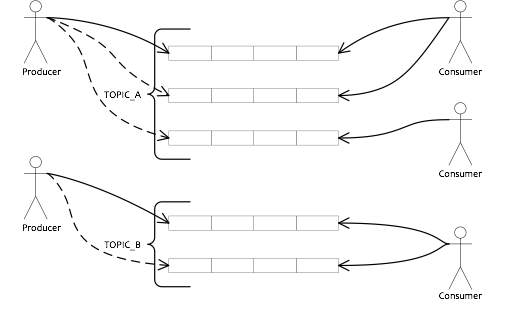
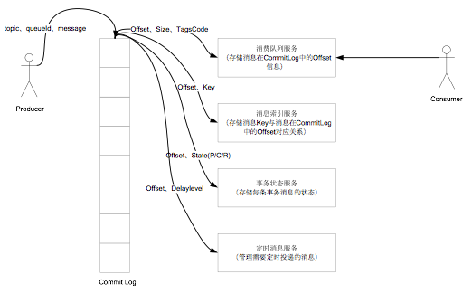

>文章：十分钟入门RocketMQ
>
>来源：阿里中间件团队博客
>
>作者：
>
>链接：http://jm.taobao.org/2017/01/12/rocketmq-quick-start-in-10-minutes/

------

  

    

      

        
          总结整理
        
        
      

    

  

待续...

  

    

      

        
          正文开始
        
        
      

    

  

本文首先引出消息中间件通常需要解决哪些问题，在解决这些问题当中会遇到什么困难，Apache  RocketMQ作为阿里开源的一款高性能、高吞吐量的分布式消息中间件否可以解决，规范中如何定义这些问题。然后本文将介绍RocketMQ的架构设计，以期让读者快速了解RocketMQ。

## 消息中间件需要解决哪些问题？

### Publish/Subscribe

发布订阅是消息中间件的最基本功能，也是相对于传统RPC通信而言。在此不再详述。

### Message Priority

规范中描述的优先级是指在一个消息队列中，每条消息都有不同的优先级，一般用整数来描述，优先级高的消息先投递，如果消息完全在一个内存队列中，那么在投递前可以按照优先级排序，令优先级高的先投递。
由于RocketMQ所有消息都是持久化的，所以如果按照优先级来排序，开销会非常大，因此RocketMQ没有特意支持消息优先级，但是可以通过变通的方式实现类似功能，即单独配置一个优先级高的队列，和一个普通优先级的队列， 将不同优先级发送到不同队列即可。

对于优先级问题，可以归纳为2类：

1. 只要达到优先级目的即可，不是严格意义上的优先级，通常将优先级划分为高、中、低，或者再多几个级别。每个优先级可以用不同的topic表示，发消息时，指定不同的topic来表示优先级，这种方式可以解决绝大部分的优先级问题，但是对业务的优先级精确性做了妥协。
2. 严格的优先级，优先级用整数表示，例如0 ~  65535，这种优先级问题一般使用不同topic解决就非常不合适。如果要让MQ解决此问题，会对MQ的性能造成非常大的影响。这里要确保一点，业务上是否确实需要这种严格的优先级，如果将优先级压缩成几个，对业务的影响有多大？

### Message Order

消息有序指的是一类消息消费时，能按照发送的顺序来消费。例如：一个订单产生了3条消息，分别是订单创建，订单付款，订单完成。消费时，要按照这个顺序消费才能有意义。但是同时订单之间是可以并行消费的。
RocketMQ可以严格的保证消息有序。

### Message Filter

#### Broker端消息过滤

在Broker中，按照Consumer的要求做过滤，优点是减少了对于Consumer无用消息的网络传输。
缺点是增加了Broker的负担，实现相对复杂。

1. 淘宝Notify支持多种过滤方式，包含直接按照消息类型过滤，灵活的语法表达式过滤，几乎可以满足最苛刻的过滤需求。
2. 淘宝RocketMQ支持按照简单的Message Tag过滤，也支持按照Message Header、body进行过滤。
3. CORBA Notification规范中也支持灵活的语法表达式过滤。

#### Consumer端消息过滤

这种过滤方式可由应用完全自定义实现，但是缺点是很多无用的消息要传输到Consumer端。

### Message Persistence

消息中间件通常采用的几种持久化方式：

1. 持久化到数据库，例如Mysql。
2. 持久化到KV存储，例如levelDB、伯克利DB等KV存储系统。
3. 文件记录形式持久化，例如Kafka，RocketMQ
4. 对内存数据做一个持久化镜像，例如beanstalkd，VisiNotify
5. (1)、(2)、(3)三种持久化方式都具有将内存队列Buffer进行扩展的能力，(4)只是一个内存的镜像，作用是当Broker挂掉重启后仍然能将之前内存的数据恢复出来。

JMS与CORBA Notification规范没有明确说明如何持久化，但是持久化部分的性能直接决定了整个消息中间件的性能。

RocketMQ充分利用Linux文件系统内存cache来提高性能。

### Message Reliablity

影响消息可靠性的几种情况：

1. Broker正常关闭
2. Broker异常Crash
3. OS Crash
4. 机器掉电，但是能立即恢复供电情况。
5. 机器无法开机（可能是cpu、主板、内存等关键设备损坏）
6. 磁盘设备损坏。

(1)、(2)、(3)、(4)四种情况都属于硬件资源可立即恢复情况，RocketMQ在这四种情况下能保证消息不丢，或者丢失少量数据（依赖刷盘方式是同步还是异步）。

(5)、(6)属于单点故障，且无法恢复，一旦发生，在此单点上的消息全部丢失。RocketMQ在这两种情况下，通过异步复制，可保证99%的消息不丢，但是仍然会有极少量的消息可能丢失。通过同步双写技术可以完全避免单点，同步双写势必会影响性能，适合对消息可靠性要求极高的场合，例如与Money相关的应用。

RocketMQ从3.0版本开始支持同步双写。

### Low Latency Messaging

在消息不堆积情况下，消息到达Broker后，能立刻到达Consumer。
RocketMQ使用长轮询Pull方式，可保证消息非常实时，消息实时性不低于Push。

### At least Once

是指每个消息必须投递一次。
RocketMQ Consumer先pull消息到本地，消费完成后，才向服务器返回ack，如果没有消费一定不会ack消息，所以RocketMQ可以很好的支持此特性。

### Exactly Only Once

1. 发送消息阶段，不允许发送重复的消息。
2. 消费消息阶段，不允许消费重复的消息。

只有以上两个条件都满足情况下，才能认为消息是“Exactly Only  Once”，而要实现以上两点，在分布式系统环境下，不可避免要产生巨大的开销。所以RocketMQ为了追求高性能，并不保证此特性，要求在业务上进行去重，也就是说消费消息要做到幂等性。RocketMQ虽然不能严格保证不重复，但是正常情况下很少会出现重复发送、消费情况，只有网络异常，Consumer启停等异常情况下会出现消息重复。

### Broker的Buffer满了怎么办？

Broker的Buffer通常指的是Broker中一个队列的内存Buffer大小，这类Buffer通常大小有限，如果Buffer满了以后怎么办？
下面是CORBA Notification规范中处理方式：

1. RejectNewEvents 拒绝新来的消息，向Producer返回RejectNewEvents错误码。
2. 按照特定策略丢弃已有消息
   - AnyOrder - Any event may be discarded on overflow. This is the default setting for this property.
   - FifoOrder - The first event received will be the first discarded.
   - LifoOrder - The last event received will be the first discarded.
   - PriorityOrder - Events should be discarded in priority order, such  that lower priority events will be discarded before higher priority  events.
   - DeadlineOrder - Events should be discarded in the order of shortest expiry deadline first.

RocketMQ没有内存Buffer概念，RocketMQ的队列都是持久化磁盘，数据定期清除。

对于此问题的解决思路，RocketMQ同其他MQ有非常显著的区别，RocketMQ的内存Buffer抽象成一个无限长度的队列，不管有多少数据进来都能装得下，这个无限是有前提的，Broker会定期删除过期的数据，例如Broker只保存3天的消息，那么这个Buffer虽然长度无限，但是3天前的数据会被从队尾删除。

此问题的本质原因是网络调用存在不确定性，即既不成功也不失败的第三种状态，所以才产生了消息重复性问题。

### 回溯消费

回溯消费是指Consumer已经消费成功的消息，由于业务上需求需要重新消费，要支持此功能，Broker在向Consumer投递成功消息后，消息仍然需要保留。并且重新消费一般是按照时间维度，例如由于Consumer系统故障，恢复后需要重新消费1小时前的数据，那么Broker要提供一种机制，可以按照时间维度来回退消费进度。
RocketMQ支持按照时间回溯消费，时间维度精确到毫秒，可以向前回溯，也可以向后回溯。

### 消息堆积

消息中间件的主要功能是异步解耦，还有个重要功能是挡住前端的数据洪峰，保证后端系统的稳定性，这就要求消息中间件具有一定的消息堆积能力，消息堆积分以下两种情况：

1. 消息堆积在内存Buffer，一旦超过内存Buffer，可以根据一定的丢弃策略来丢弃消息，如CORBA  Notification规范中描述。适合能容忍丢弃消息的业务，这种情况消息的堆积能力主要在于内存Buffer大小，而且消息堆积后，性能下降不会太大，因为内存中数据多少对于对外提供的访问能力影响有限。
2. 消息堆积到持久化存储系统中，例如DB，KV存储，文件记录形式。 当消息不能在内存Cache命中时，要不可避免的访问磁盘，会产生大量读IO，读IO的吞吐量直接决定了消息堆积后的访问能力。

评估消息堆积能力主要有以下四点：

1. 消息能堆积多少条，多少字节？即消息的堆积容量。
2. 消息堆积后，发消息的吞吐量大小，是否会受堆积影响？
3. 消息堆积后，正常消费的Consumer是否会受影响？
4. 消息堆积后，访问堆积在磁盘的消息时，吞吐量有多大？

### 分布式事务

已知的几个分布式事务规范，如XA，JTA等。其中XA规范被各大数据库厂商广泛支持，如Oracle，Mysql等。其中XA的TM实现佼佼者如Oracle Tuxedo，在金融、电信等领域被广泛应用。

分布式事务涉及到两阶段提交问题，在数据存储方面的方面必然需要KV存储的支持，因为第二阶段的提交回滚需要修改消息状态，一定涉及到根据Key去查找Message的动作。RocketMQ在第二阶段绕过了根据Key去查找Message的问题，采用第一阶段发送Prepared消息时，拿到了消息的Offset，第二阶段通过Offset去访问消息，并修改状态，Offset就是数据的地址。

RocketMQ这种实现事务方式，没有通过KV存储做，而是通过Offset方式，存在一个显著缺陷，即通过Offset更改数据，会令系统的脏页过多，需要特别关注。

### 定时消息

定时消息是指消息发到Broker后，不能立刻被Consumer消费，要到特定的时间点或者等待特定的时间后才能被消费。
如果要支持任意的时间精度，在Broker层面，必须要做消息排序，如果再涉及到持久化，那么消息排序要不可避免的产生巨大性能开销。
RocketMQ支持定时消息，但是不支持任意时间精度，支持特定的level，例如定时5s，10s，1m等。

### 消息重试

Consumer消费消息失败后，要提供一种重试机制，令消息再消费一次。Consumer消费消息失败通常可以认为有以下几种情况：

1. 由于消息本身的原因，例如反序列化失败，消息数据本身无法处理（例如话费充值，当前消息的手机号被注销，无法充值）等。这种错误通常需要跳过这条消息，再消费其他消息，而这条失败的消息即使立刻重试消费，99%也不成功，所以最好提供一种定时重试机制，即过10s秒后再重试。
2. 由于依赖的下游应用服务不可用，例如db连接不可用，外系统网络不可达等。遇到这种错误，即使跳过当前失败的消息，消费其他消息同样也会报错。这种情况建议应用sleep 30s，再消费下一条消息，这样可以减轻Broker重试消息的压力。

## RocketMQ Overview

RocketMQ是否解决了上述消息中间件面临的问题，接下来让我们一探究竟。

### RocketMQ 是什么？

上图是一个典型的消息中间件收发消息的模型，RocketMQ也是这样的设计，简单说来，RocketMQ具有以下特点：

- 是一个队列模型的消息中间件，具有高性能、高可靠、高实时、分布式特点。
- Producer、Consumer、队列都可以分布式。
- Producer向一些队列轮流发送消息，队列集合称为Topic，Consumer如果做广播消费，则一个consumer实例消费这个Topic对应的所有队列，如果做集群消费，则多个Consumer实例平均消费这个topic对应的队列集合。
- 能够保证严格的消息顺序
- 提供丰富的消息拉取模式
- 高效的订阅者水平扩展能力
- 实时的消息订阅机制
- 亿级消息堆积能力
- 较少的依赖

### RocketMQ 物理部署结构

如上图所示， RocketMQ的部署结构有以下特点：

- Name Server是一个几乎无状态节点，可集群部署，节点之间无任何信息同步。
- Broker部署相对复杂，Broker分为Master与Slave，一个Master可以对应多个Slave，但是一个Slave只能对应一个Master，Master与Slave的对应关系通过指定相同的BrokerName，不同的BrokerId来定义，BrokerId为0表示Master，非0表示Slave。Master也可以部署多个。每个Broker与Name Server集群中的所有节点建立长连接，定时注册Topic信息到所有Name Server。
- Producer与Name Server集群中的其中一个节点（随机选择）建立长连接，定期从Name Server取Topic路由信息，并向提供Topic服务的Master建立长连接，且定时向Master发送心跳。Producer完全无状态，可集群部署。
- Consumer与Name Server集群中的其中一个节点（随机选择）建立长连接，定期从Name  Server取Topic路由信息，并向提供Topic服务的Master、Slave建立长连接，且定时向Master、Slave发送心跳。Consumer既可以从Master订阅消息，也可以从Slave订阅消息，订阅规则由Broker配置决定。

### RocketMQ 逻辑部署结构

如上图所示，RocketMQ的逻辑部署结构有Producer和Consumer两个特点。

Producer Group

用来表示一个发送消息应用，一个Producer  Group下包含多个Producer实例，可以是多台机器，也可以是一台机器的多个进程，或者一个进程的多个Producer对象。一个Producer Group可以发送多个Topic消息，Producer Group作用如下：

1. 标识一类Producer
2. 可以通过运维工具查询这个发送消息应用下有多个Producer实例
3. 发送分布式事务消息时，如果Producer中途意外宕机，Broker会主动回调Producer Group内的任意一台机器来确认事务状态。

Consumer Group

用来表示一个消费消息应用，一个Consumer  Group下包含多个Consumer实例，可以是多台机器，也可以是多个进程，或者是一个进程的多个Consumer对象。一个Consumer  Group下的多个Consumer以均摊方式消费消息，如果设置为广播方式，那么这个Consumer Group下的每个实例都消费全量数据。

### RocketMQ 数据存储结构

如上图所示，RocketMQ采取了一种数据与索引分离的存储方法。有效降低文件资源、IO资源，内存资源的损耗。即便是阿里这种海量数据，高并发场景也能够有效降低端到端延迟，并具备较强的横向扩展能力。